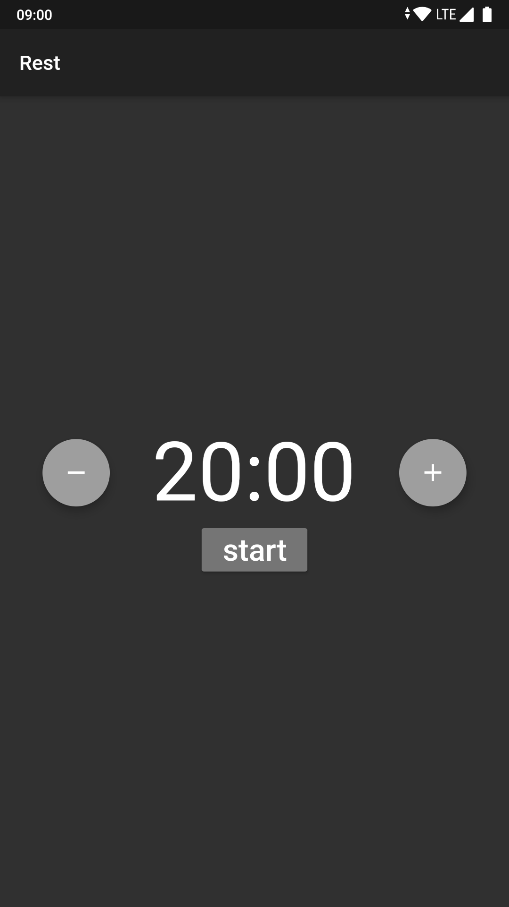
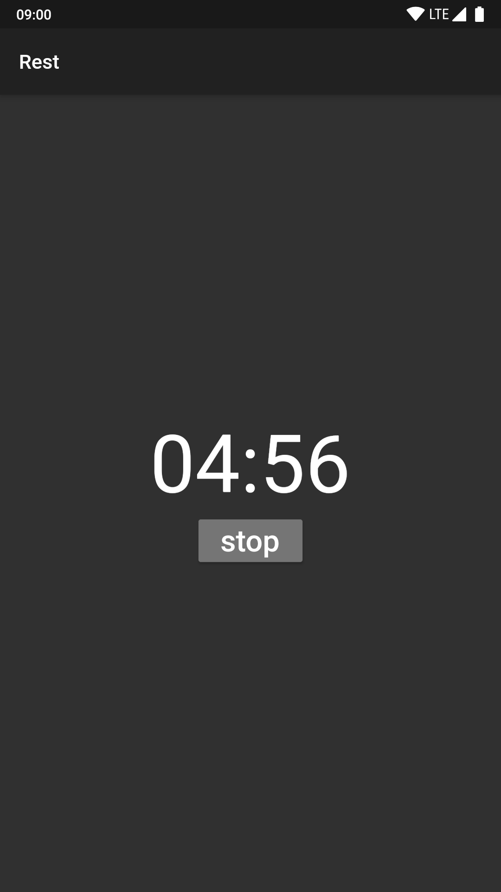

# rest

A simple app that will pause music after a period of time.
This app was developed with Flutter

## Install from Google Play

<a href="https://play.google.com/store/apps/details?id=dev.protium.rest">
  
</a>

## Development
Dependencies:
* Android SDK
* Android Studio
* Flutter SDK

Check your dependencies with `flutter doctor` 
## Testing
```
flutter test
flutter drive --target=test_driver/home_page.dart 
```

## Running
`flutter run`

## Screenshots






## TODOs
* Add sticky notification
* Show toast message when music is paused
